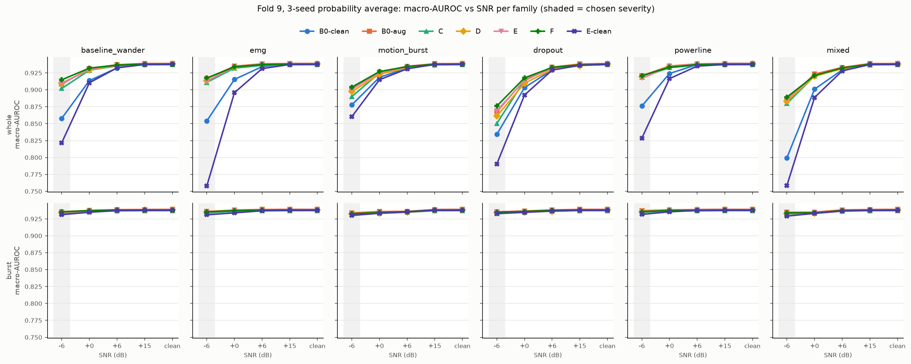
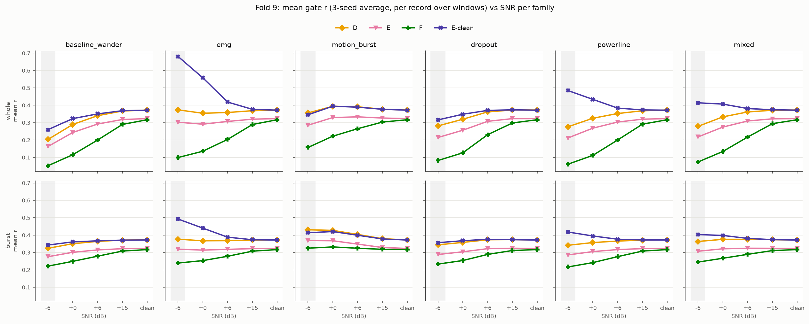

# medico-ecg

**Does reliability gating help ECG classifiers beyond noise augmentation?**
A pre-registered benchmark of ECG robustness on PTB-XL, with external checks on NSTDB, CinC 2017 and BUT QDB.

   

## TL;DR

We proposed RACER, a lightweight ECG model with an explicit per-window reliability signal `r` that gates local
morphology features. We tested it against augmented baselines under controlled and real noise, with decision
rules written and committed to git before each run.

| Question | Answer |
|---|---|
| Is the 12-lead PTB-XL pipeline competitive with published results? | **Yes.** 15-model ensemble 0.9363 test macro-AUROC (published ensemble 0.934); best single model 0.9335 (published 0.930). |
| Does the gate beat noise augmentation on synthetic noise? | **No.** Pre-registered NO-GO. Augmentation gives +0.043 on mixed noise at -6 dB; the best gated variant adds +0.002 on top, below the +0.005 bar. |
| Does it hold on real noise (NSTDB)? | **No.** F is -0.008 to -0.010 vs augmented baseline [CI excludes 0]. Training on real noise gives +0.025 and the gate adds nothing on top. |
| Does `r` track signal quality outside the benchmark? | **No.** On CinC 2017 `r` does not separate "Noisy" recordings (AUROC 0.35-0.54); on BUT QDB it is inverted (higher on worse windows). |
| What is the contribution? | A reproducible robustness benchmark, calibrated strong baselines, and a well-documented negative result on reliability gating. |

## Headline results

### 1. PTB-XL superclass benchmark (test = fold 10, each entry scored once)

| entry | fold-10 macro-AUROC | 95% CI (patient bootstrap) | published |
|---|---|---|---|
| Ensemble, 15 models (3 architectures x 5 seeds) | **0.9363** | 0.9291-0.9428 | 0.934 |
| Single: resnet1d_wang + label smoothing 0.05 | **0.9335** | 0.9259-0.9401 | 0.930 |
| resnet1d_wang reproduced | 0.9332 | 0.9255-0.9399 | 0.930 |
| xresnet1d101 reproduced | 0.9309 | 0.9233-0.9378 | 0.928 |

Ensemble minus reproduced resnet1d_wang: +0.0031 [+0.0012, +0.0051] (paired patient bootstrap).
Per-record z-scoring hurts HYP; dataset-level standardization is used throughout. Details: [round 2](track1/reports/round2_summary.md), [round 3](track1/reports/round3_summary.md).

### 2. Robustness under synthetic corruption (Track 2, fold 9, -6 dB, 3-seed average, macro-AUROC)



| model | clean | seen | unseen | mixed | all corrupted |
|---|---|---|---|---|---|
| B0-clean (no augmentation) | 0.9389 | 0.8947 | 0.8985 | 0.8661 | 0.8919 |
| B0-aug (augmentation baseline) | 0.9389 | 0.9241 | 0.9161 | 0.9094 | 0.9177 |
| C (concat) | 0.9371 | 0.9201 | 0.9096 | 0.9059 | 0.9125 |
| D (generic gate) | 0.9380 | 0.9231 | 0.9132 | 0.9080 | 0.9156 |
| E (reliability gate) | 0.9381 | 0.9231 | 0.9148 | 0.9097 | 0.9167 |
| F (E + consistency + severity ranking) | 0.9380 | 0.9257 | 0.9173 | 0.9115 | 0.9191 |
| E-clean (E, no augmentation) | 0.9376 | 0.8604 | 0.8789 | 0.8438 | 0.8669 |

Corruptions: baseline wander and EMG (seen in training); motion burst, dropout and powerline (unseen); mixed.
Whole-record and 2-4 s burst modes, each lead scaled to its own SNR. 53 unit tests.
The fold-10 reporting pass reproduces the conclusion: F - B0-aug = +0.0025 [+0.0003, +0.0044] on mixed@-6, short of the +0.005 bar
([fold10_report.md](track1/results/track2/fold10_report.md)).

### 3. Does `r` behave like a quality signal?



- On synthetic noise F's `r` falls with severity for every family except motion bursts, and it is not lower on abnormal records. Without augmentation (E-clean) `r` *rises* under EMG and powerline.
- Real noise (NSTDB): `r` falls with noise, but F still loses to augmentation ([nstdb.md](track1/results/track2/nstdb.md)).
- CinC 2017 "Noisy" class: not supported for any model under the pre-registered analysis ([cinc2017.md](track1/results/track2/cinc2017.md)). A per-record z-score sensitivity analysis gives AUROC 0.70-0.77, reported as exploratory.
- BUT QDB: `r` is higher in class 2 than class 1, the wrong direction, and rises with accelerometer motion ([butqdb.md](track1/results/track2/butqdb.md)). Caveat: the protocol assumptions A1-A8 are in [RULES2.md](track1/results/track2/RULES2.md).

### 4. Phase 1 pilot (PTB-XL lead II, 30 runs): NO-GO

Single-lead A/C/E x clean/aug x 5 seeds. E matched the augmented CNN (+0.0001 [-0.0024, +0.0025] on mixed) and the verdict was NO-GO,
which is why the project pivoted to the benchmark-and-analysis framing. See [phase1/results/summary.md](phase1/results/summary.md).

## Research integrity

- **Pre-registration by commit.** Decision rules ([RULES.md](track1/results/track2/RULES.md), [RULES2.md](track1/results/track2/RULES2.md), [SELECTION2.md](track1/results/crop/SELECTION2.md)) were committed before the runs they govern; check `git log`.
- **Fold 9 for every choice.** Fold 10 is touched only in logged passes: [FOLD10_LOG.md](track1/results/track2/FOLD10_LOG.md) (36 entries, with a disclosure of one count correction).
- **Patient-level bootstrap** for all confidence intervals; paired for model differences.
- **Seed spread reported.** Seed std on corrupted groups (0.001-0.006) exceeds most variant gaps.
- **Patient-leakage check** across folds in [track1/check_data.py](track1/check_data.py).

## Repository map

```
.
├── phase1/            RACER Phase 1 pilot: lead II, synthetic noise, A/C/E, 30 runs (own README, configs, tests)
├── track1/            PTB-XL 12-lead benchmark, corruption benchmark and all Track 2 experiments
│   ├── models.py, track2_models.py     ResNet/Inception/xResNet baselines; B0, C, D, E, F variants
│   ├── train.py                        training (--aug, --aux, crops, SWA/EMA, label smoothing)
│   ├── corruptions.py                  synthetic corruption generators (+ nstdb.py for real noise)
│   ├── track2_eval.py, *_report.py     evaluation, bootstrap CIs, report generators
│   ├── cinc2017.py, butqdb.py          external-dataset pipelines
│   ├── scripts/                        resumable shell pipelines for every stage
│   ├── tests/                          85 tests
│   ├── reports/                        plain-language summaries of each round
│   ├── results/                        JSON and Markdown results, figures, rules and logs
│   └── logs/                           training and pipeline logs
├── docs/              master.md (spec), actual.md (plan v2), CONTRACT.md, decisions.md
├── environment.yml    conda env "medico"
└── data/              datasets (not in git)
```

Not in git because of size: datasets (~8 GB), model checkpoints (`*.pt`, 175 MB) and cached predictions (`*.npz`, ~630 MB).

## Reproduce

```bash
conda env create -f environment.yml && conda activate medico

# data (PhysioNet, no login needed)
aws s3 sync --no-sign-request s3://physionet-open/ptb-xl/1.0.3/ data/ptb-xl/
# NSTDB, CinC 2017 and BUT QDB commands: phase1/README.md ("Data")

cd track1
python check_data.py                       # folds, prevalence, leakage check
bash scripts/run_all.sh                    # M1/M2 baseline pipeline
bash scripts/run_seeds.sh && bash scripts/run_crops.sh   # round 2-3 benchmark and ensemble
bash scripts/run_track2.sh && bash scripts/run_track2_eval.sh   # Track 2 training and evaluation
bash scripts/run_real.sh && bash scripts/run_external.sh        # real-noise training, CinC 2017, BUT QDB
pytest tests -q                            # 85 tests

cd ../phase1 && pytest tests -q            # 195 tests
```

All scripts are resumable (completed runs are skipped). Developed on Apple Silicon (MPS); fp16 was slower than fp32 there.

## Limitations

- PTB-XL at 100 Hz only; 500 Hz and other cohorts are not covered.
- Synthetic noise is simple (additive, SNR-scaled); NSTDB is the only real-noise source, and BUT QDB's protocol was reconstructed from assumptions.
- 3 seeds per variant in Track 2; some gaps are within seed noise, which is why all rules are paired and CI-based.
- The negative result concerns this gate design and training recipe, not reliability estimation in general.

## License

Code: [MIT](LICENSE). PTB-XL, NSTDB, CinC 2017 and BUT QDB are distributed by PhysioNet under their own licenses and are not included.

## Documents

[Project spec](docs/master.md) · [Research plan v2](docs/actual.md) · [Interface contract](docs/CONTRACT.md) · [Decision log](docs/decisions.md) · [Track 2 report](track1/results/track2/REPORT.md) · [Follow-ups summary](track1/results/track2/FOLLOWUPS_SUMMARY.md)
